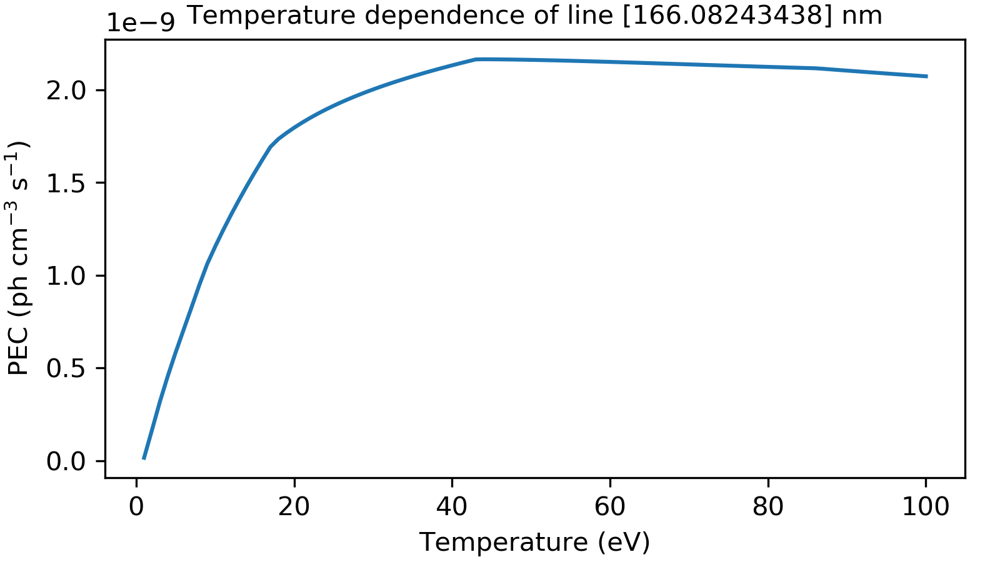
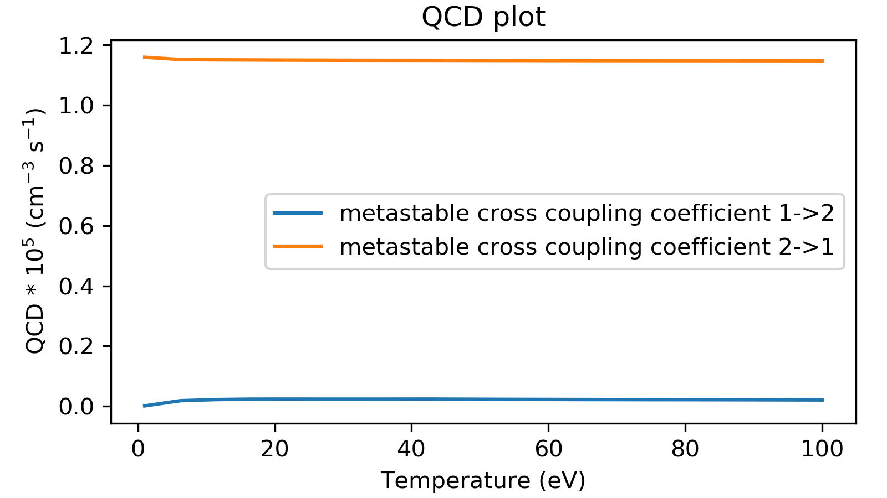
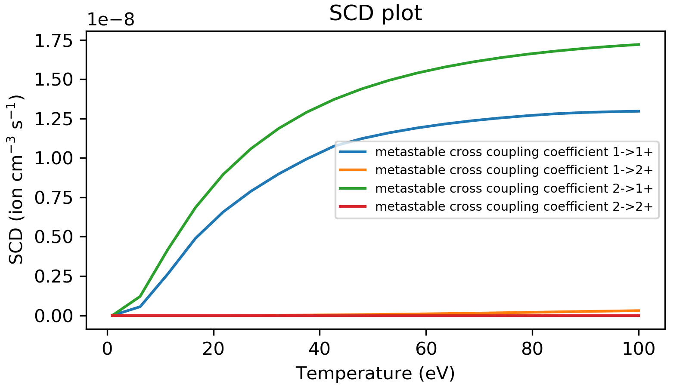
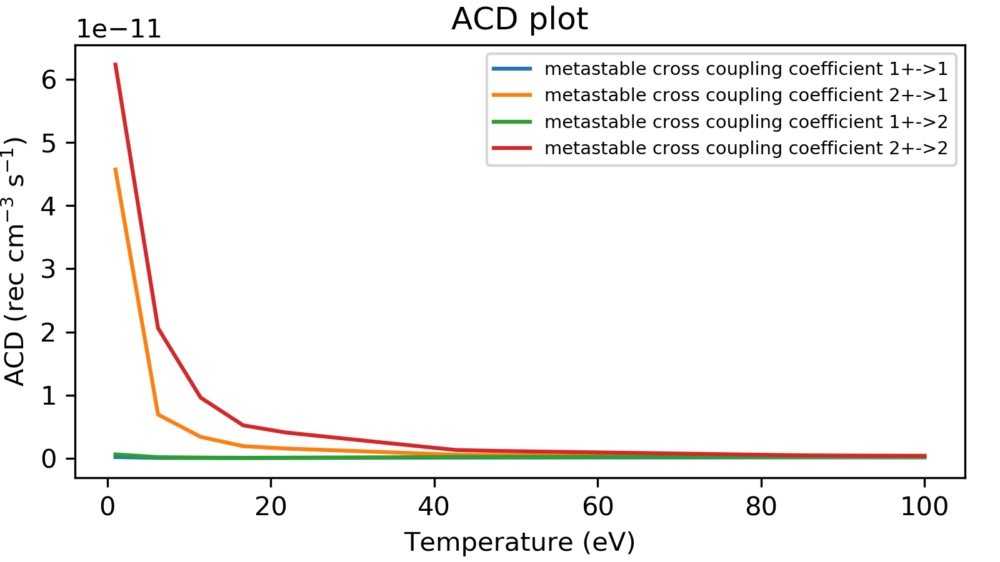
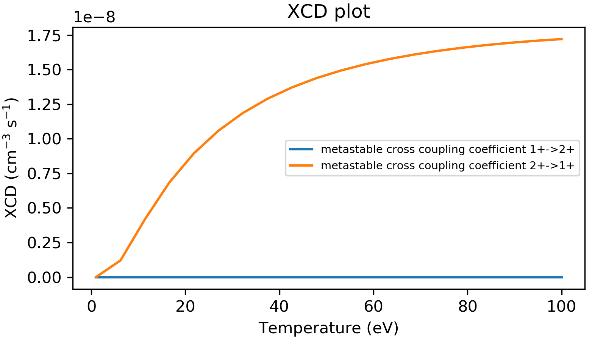
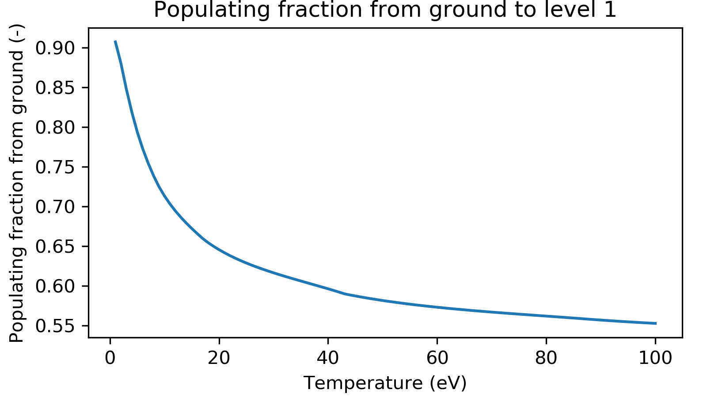
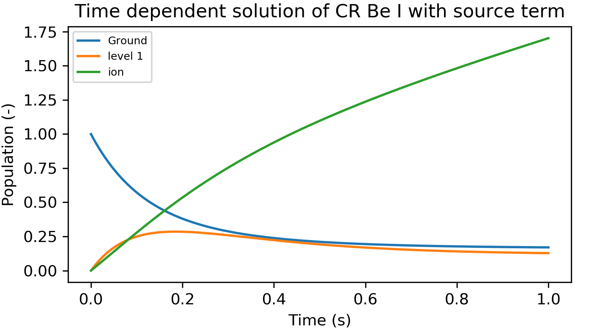

=============
Tutorial
=============
This tutorial will take the user through the basics of atomic data needed for CR modeling.
The python scripts for these examples can be found in the 'examples' folder.

Neither the local thermodynamic equilibrium (LTE) or conornal approximations are valid for fusion plasmas.
These plasma must be modeled with a collisional radiative (CR) model which includes effects of electron density.
Collisional Radiative theory has been updated to included general collisional radiative (GCR) theory, this is
outlined in (Summers 2006).

Atomic Data and the ADF04 File
==============================
Atomic data is generally made by calculating cross-sections (probablity) of transitions.
From these cross-sections rates and then made by convolving with a maxwellian temperature distriubtion of electron
energies with the cross section. The rates are what is used in the CR model.

The ADF04 file format from ADAS that is used to hold atomic data for input into the CR model. The ADF04 file is supported as
an input to colradpy.

Electron impact de/excitation
-----------------------------
Electron impact excitation and deexcitation is what causes transitions be the ground and excited states and within excited
states. There rates are stored as "effective collisional strengths" in the adf04 file. These can then be converted to the
excitiation and deexcitation rates that are needed for CR modeling.

Electron ionization
-------------------
Electrons can also ionize atoms to the next charge state. Ionization can be stored in the adf04 file as reduced ionization
rates. ColRadPy is also capable of making ECIP ionization rates. ECIP ionization is a very approximate way of making ionization
and should be avoid if possible. Ground and metastable states generally have calculated ionization rates while excited states
generally have rates that are supplimented with ECIP.

Radative Recombination
----------------------

Dielectronic Recombination
----------------------

Three Body Recombination
------------------------
Three body recombination is calculated from using detailed balance from the ionization

Running ColRadPy
================

:ref:`ColRadPy <colradpy>` requires multiple inputs from the user to run.
The basic quasistatic run will be discussed first. This should be sufficient for most users.
Once the code runs data is store in a dictionary accessed through the '.data' method.
The entries of this dictionary and descriptions are documented :ref:`here.<colradpy_dict>`

* Atomic data input file - currently this is limitted to an ADF04 file but there is nothing special about it.

* array of metastable levels - This is an array of levels that includes the ground and any levels that could be considered metastable.

* temperature grid - This is an array of electron temperatures for the calculation in eV.

* Density grid     - This is an array of electron densities for the calculation in cm-3.

In this example Be II (Be+) is used because it is a simple system that has a parent ion
(the next charge state) that has a metastable.
This allows all of the different functionality to be shown and tested.

#. The module  must be executed
#. Input file, temperature, density and metastable inputs defined.
#. Ionization, recombination options chosen default values are true

.. code-block:: python
   :linenos:

   import sys
   sys.path.append('../')
   from colradpy_class import colradpy
   import numpy as np

   fil = 'cpb03_ls#be0.dat' #adf04 file
   temperature_arr = np.linspace(1,100,100) #eV
   metastable_levels = np.array([0])   #metastable level, just ground chosen here
   density_arr =     np.array([1.e13,4.e14]) # cm-3
   be = colradpy(fil,metastable_levels,temperature_arr,density_arr,use_recombination=True,
		 use_recombination_three_body = True,use_ionization=True,suppliment_with_ecip=True)
   
'be' is now a colradpy class, there are many different calls that could be made from the class :ref:`documented here <colradpy>`.
The general flow of the code goes as

#. create rates
#. populate matrix
#. solve matrix and create post processed data.

   
.. code-block:: python
   :linenos:

   if(be.data['user']['use_ionization']):
       be.make_ioniz_from_reduced_ionizrates()
   if(be.data['user']['suppliment_with_ecip']):
       be.make_ecip()
       be.suppliment_with_ecip()
   if(be.data['user']['use_recombination']):
       be.make_recombination_rates_from_file()
   if(be.data['user']['use_recombination_three_body']):
       be.make_three_body_recombination()
       
   
.. code-block:: python
   :linenos:

   be.populate_cr_matrix()

.. code-block:: python
   :linenos:

   be.solve_quasi_static()
   
   
This can be done from one call to colradpy. Which does the procedure above.

.. code-block:: python
   :linenos:

   be.solve_cr_qausistatic()

Data from the calculation is now avaible in the '.data' dictionary.
Various postpocessing can be done to now analysis the calcuation.

Post processing analysis
=========================

Photon emissivity coefficients (PECs)
--------------------------------------

A theortical spectrum can be made from the PEC coefficients.
PEC coefficient are stored in array that has shape (#pecs,metastable,temperature,density).
The code below produces a PEC spectrum for on temperature and density.
The wavelength and pec arrays share the same length.

.. code-block:: python
   :linenos:

   import matplotlib.pyplot as plt
   plt.ion()
   met = 0 #metastable 0, this corresponds to the ground state
   te = 0 #first temperature in the grid
   ne = 0 #frist density in the grid

   fig, ax1 = plt.subplots(1,1,figsize=(16/3.,9/3.),dpi=300)
   fig.subplots_adjust(bottom=0.15,top=0.92,left=0.105,right=0.965)
   ax1.vlines(be.data['processed']['wave_air'],
	      np.zeros_like(be.data['processed']['wave_air']),
	      be.data['processed']['pecs'][:,met,te,ne])
   ax1.set_xlim(0,1000)
   ax1.set_title('PEC spectrum  T$_e$=' +str(be.data['user']['temp_grid'][te])+\
		 ' eV  ne=' + "%0.*e"%(2,be.data['user']['dens_grid'][ne]) + ' cm$^{-3}$',size=10)
   ax1.set_xlabel('Wavelength (nm)')
   ax1.set_ylabel('PEC (ph cm$^{-3}$ s$^{-1}$)')

.. figure:: be0_pec_0_1000.png
   :scale: 50 %
   :alt: Be I pecs 0-1000 nm

   
Often the index of a specific pec is wanted to find its temperature or density dependence.
This can be accomplished in two basic ways.

#. Upper and lower levels of the transitions are known
#. The wavelength of the transition is known

There is a map from transition numbers to pec index levels. .data['processed']['pec_levels'] has
the same order as .data['processed']['wave_air'] and .data['processed']['pecs'].

.. code-block:: python
   :linenos:

   print(np.shape(be.data['processed']['wave_air']),
	 np.shape(be.data['processed']['pecs']),
	 np.shape(be.data['processed']['pec_levels']))
   #(320,) (320, 3, 1, 1) (320, 2)

   upper_ind = 7 #ninth excited state
   lower_ind = 0  #ground state

   pec_ind = np.where( (be.data['processed']['pec_levels'][:,0] == upper_ind) &\
		       (be.data['processed']['pec_levels'][:,1] == lower_ind))[0]

   #plot the temeprature dependence of the chosen pec at first density in the grid
   fig, ax1 = plt.subplots(1,1,figsize=(16/3.,9/3.),dpi=300)
   fig.subplots_adjust(bottom=0.15,top=0.93,left=0.105,right=0.965)
   ax1.set_title('Temperature dependence of line ' +\
		 str(be.data['processed']['wave_air'][pec_ind]) +' nm',size=10)
   ax1.plot(be.data['user']['temp_grid'],be.data['processed']['pecs'][pec_ind[0],met,:,ne])
   ax1.set_xlabel('Temperature (eV)')
   ax1.set_ylabel('PEC (ph cm$^{-3}$ s$^{-1}$)')

   #plot the density dependence of the chosen pec at first density in the grid
   fig, ax1 = plt.subplots(1,1,figsize=(16/3.,9/3.),dpi=300)
   fig.subplots_adjust(bottom=0.15,top=0.93,left=0.125,right=0.965)
   ax1.set_title('Density dependence of line ' +\
		 str(be.data['processed']['wave_air'][pec_ind]) +' nm',size=10)
   ax1.plot(be.data['user']['dens_grid'],be.data['processed']['pecs'][pec_ind[0],met,te,:])
   ax1.set_xlabel('Density (cm$^{-3}$)')
   ax1.set_ylabel('PEC (ph cm$^{-3}$ s$^{-1}$)')

If the wavelength of a line of interest is known, the index can be found by looking at the
wavelength array.
The indices of all pecs that fall within the upper and lower bound of the 'where' statement are
returned. PECs can generally be distinguished by the actual value, large lines that are of interest
have much large PEC values, this can allow 

.. figure:: be0_pec_dens.png
   :scale: 50 %
   :alt: Be I density

.. code-block:: python
   :linenos:

   #want to find the index of Be I line at 351.55
   pec_ind = np.where( (be.data['processed']['wave_air'] <352) &\
		       (be.data['processed']['wave_air'] >351))
   print('Wavelength from file ' + str(be.data['processed']['wave_air'][pec_ind[0]]))
   #Wavelength from file [351.55028742]
   print('PEC upper and lower levels '+ str(be.data['processed']['pec_levels'][pec_ind[0]]))
   #PEC upper and lower levels [[25  2]]
   

Generalized radiative coefficients (GCRs)
-----------------------------------------

The generalized collsional radiative coefficients are calculated by ColRadPy as well.
A description of these can be found in (Summers 2006), (Johnson 2019).
GCR coefficients are often use as inputs to plasma transport codes.
GCR coefficients are also use as inputs to ionization balance calculations which will be discussed
later. This allows for different ionization stages to be linked.

A physical description of the GCRs can be helpful in interpreting the meaning behind
them. For example, the total ionization from one charge state to the other is defined as the SCD.
The total recombination from a charge state to the charge state of interest is defined as the ACD.
This gives the rate of population transfer from one ionization state to a lower ionization state.
The situation for systems with metastable states requires that the effective ionization and
recombination rates be metastable resolved.
In addition, it requires metastable cross coupling coefficients known as QCD and XCD coefficients.

Generally it is of interest to look at how the GCR coefficients change with some parameter such
as temperature. Plots are shown below of the different GCRs.

For this example we will look at Be II this is soley because Be III has two metastable states.
This means that the XCD will have non-zero values. Remeber the call from before for Be I.

.. code-block:: python
   :linenos:

   import sys
   sys.path.append('../')
   from colradpy_class import colradpy
   import numpy as np

   fil = 'cpb03_ls#be1.dat' #adf04 file
   temperature_arr = np.linspace(1,100,20) #eV
   metastable_levels = np.array([0,1])   #ground and level 1 chosen to be metastable
   density_arr =     np.array([1.e13,8.e13,4.e14]) # cm-3
   beii = colradpy(fil,metastable_levels,temperature_arr,density_arr,use_recombination=True,
		 use_recombination_three_body = True,use_ionization=True,suppliment_with_ecip=True)
   beii.solve_cr()

.. code-block:: python
   :linenos:
      
   #plotting the QCD
   import matplotlib.pyplot as plt
   plt.ion
   fig, ax1 = plt.subplots(1,1,figsize=(16/3.,9/3.),dpi=300)
   fig.subplots_adjust(bottom=0.15,top=0.92,left=0.125,right=0.965)
   ax1.plot(beii.data['user']['temp_grid'],
	    beii.data['processed']['qcd'][0,1,:,0]*1e5,
	    label = 'metastable cross coupling coefficient 1->2')

   ax1.plot(beii.data['user']['temp_grid'],
	    beii.data['processed']['qcd'][1,0,:,0]*1e5,
	    label = 'metastable cross coupling coefficient 2->1')
   ax1.legend()
   ax1.set_title('QCD plot')
   ax1.set_xlabel('Temperature (eV)')
   ax1.set_ylabel('QCD * 10$^5$ (cm$^{-3}$ s$^{-1}$)')

	 
.. code-block:: python
   :linenos:
      
   #plotting the SCD
   fig, ax1 = plt.subplots(1,1,figsize=(16/3.,9/3.),dpi=300)
   fig.subplots_adjust(bottom=0.15,top=0.92,left=0.125,right=0.965)
   ax1.plot(beii.data['user']['temp_grid'],
	    beii.data['processed']['scd'][0,0,:,0],
	    label = 'metastable cross coupling coefficient 1->1+')

   ax1.plot(beii.data['user']['temp_grid'],
	    beii.data['processed']['scd'][0,1,:,0],
	    label = 'metastable cross coupling coefficient 1->2+')

   ax1.plot(beii.data['user']['temp_grid'],
	    beii.data['processed']['scd'][1,0,:,0],
	    label = 'metastable cross coupling coefficient 2->1+')

   ax1.plot(beii.data['user']['temp_grid'],
	    beii.data['processed']['scd'][1,1,:,0],
	    label = 'metastable cross coupling coefficient 2->2+')

   ax1.legend(fontsize='x-small',loc='best')
   ax1.set_title('SCD plot')
   ax1.set_xlabel('Temperature (eV)')
   ax1.set_ylabel('SCD (ion cm$^{-3}$ s$^{-1}$)')

.. code-block:: python
   :linenos:

   #plotting the ACD
   fig, ax1 = plt.subplots(1,1,figsize=(16/3.,9/3.),dpi=300)
   fig.subplots_adjust(bottom=0.15,top=0.92,left=0.075,right=0.965)
   ax1.plot(beii.data['user']['temp_grid'],
	    beii.data['processed']['acd'][0,0,:,0],
	    label = 'metastable cross coupling coefficient 1+->1')

   ax1.plot(beii.data['user']['temp_grid'],
	    beii.data['processed']['acd'][0,1,:,0],
	    label = 'metastable cross coupling coefficient 2+->1')

   ax1.plot(beii.data['user']['temp_grid'],
	    beii.data['processed']['acd'][1,0,:,0],
	    label = 'metastable cross coupling coefficient 1+->2')

   ax1.plot(beii.data['user']['temp_grid'],
	    beii.data['processed']['acd'][1,1,:,0],
	    label = 'metastable cross coupling coefficient 2+->2')

   ax1.legend(fontsize='x-small',loc='best')
   ax1.set_title('ACD plot')
   ax1.set_xlabel('Temperature (eV)')
   ax1.set_ylabel('ACD (rec cm$^{-3}$ s$^{-1}$)')

   
.. code-block:: python
   :linenos:

   #plotting the XCD
   fig, ax1 = plt.subplots(1,1,figsize=(16/3.,9/3.),dpi=300)
   fig.subplots_adjust(bottom=0.15,top=0.92,left=0.12,right=0.965)
   ax1.plot(beii.data['user']['temp_grid'],
	    beii.data['processed']['xcd'][0,1,:,0],
	    label = 'metastable cross coupling coefficient 1+->2+')

   ax1.plot(beii.data['user']['temp_grid'],
	    beii.data['processed']['scd'][1,0,:,0],
	    label = 'metastable cross coupling coefficient 2+->1+')
   ax1.legend(fontsize='x-small',loc='best')
   ax1.set_title('XCD plot')
   ax1.set_xlabel('Temperature (eV)')
   ax1.set_ylabel('XCD (cm$^{-3}$ s$^{-1}$)')

One feature unique to ColRadPy is the ability to determine the populating mechanism of levels.
This allows one to see which levels in a calculation are important to modeling the spectral lines of interest.
This allows those that generate the atomic data to know which transitions are required to accurately
model spectral lines. With this new analysis technique, it is possible to identify transitions that are
the most important and allow for complex systems such as high-Z near neutral systems to be simplified.

.. code-block:: python
   :linenos:
      
   #plotting the populating levels
   plt.figure()
   plt.figure();plt.plot(be.data['processed']['pop_lvl'][0,:,0,0,0]/\
                         np.sum(be.data['processed']['pop_lvl'][0,:,0,0,0]))

   plt.figure();plt.plot(be.data['processed']['pop_lvl'][0,:,0,10,0]/\
                         np.sum(be.data['processed']['pop_lvl'][0,:,0,10,0]))

   plt.figure();plt.plot(be.data['processed']['pop_lvl'][0,:,0,-1,0]/\
                         np.sum(be.data['processed']['pop_lvl'][0,:,0,-1,0]))
   
   plt.legend()
   plt.xlabel('Level number (#)')
   plt.ylabel('Populating fraction (-)')

   #plotting the populating fraction from the ground versus temperature
   plt.figure()
   plt.plot(be.data['user']['temp_grid'],
             be.data['processed']['pop_lvl'][10,0,0,:,0]/\
	     np.sum(be.data['processed']['pop_lvl'][10,:,0,:,0],axis=0))
	     
   plt.xlabel('Temperature (eV)')
   plt.ylabel('Populating fraction from ground (-)')

.. figure:: be0_pop_lvl.png
   :scale: 50 %
   :alt: Be I populating levels

   This shows that as temperature increase other excited levels contributed more and more
   to the first excited state

	 

   This shows that as the temperature increases the ground tributes less to the total population
   of level 1.
   

   

Advanced functionality
=======================

Time dependent CR modeling
--------------------------

ColRadPy is also capable of solving the full collisional radiative matrix time-dependently.
This can be important for systems where there is significant population in
many excited states or where ultra fast timescales need to be considered.
Instead of the quasi-static approximation used in Equation 4 where excited states are assumed to
have no population change, the matrix is solved as a system of ordinary differential equations n (t) = An(t).
This method used to solve the system of equations was adapted from R. LeVeque.

Case in which with and without a source term can be considered in ColRadPy.
The case without a source term can used in a system like a linear machine with views that are
transverse to the direction of motion of the particles.

A source term can be used when the line of sight includes a source of particles.
The source term could also be used to model the pumping of specific levels with LIF.

.. code-block:: python
   :linenos:
      
   import sys
   sys.path.append('../')
   from colradpy_class import colradpy
   import numpy as np
   import matplotlib.pyplot as plt

   #Time dependent CR modeling
   td_t = np.geomspace(1.e-5,.1,1000)
   td_n0 = np.zeros(30)
   td_n0[0] = 1.

   fil = 'cpb03_ls#be0.dat' #adf04 file
   temperature_arr = np.array([10]) #eV
   metastable_levels = np.array([0])   #metastable level, just ground chosen here
   density_arr =     np.array([1.e9]) # cm-3
   be = colradpy(fil,metastable_levels,temperature_arr,density_arr,use_recombination=True,
		 use_recombination_three_body = True,use_ionization=True,suppliment_with_ecip=True,
		 td_t=td_t,td_n0=td_n0,td_source=td_s)
   be.solve_cr()
   be.solve_time_dependent()

   fig, ax1 = plt.subplots(1,1,figsize=(16/3.,9/3.),dpi=300)
   fig.subplots_adjust(bottom=0.15,top=0.92,left=0.1,right=0.965)
   plt.plot(be.data['user']['td_t'],
	    be.data['processed']['td']['td_pop'][0,:,0,0],
	    label='Ground')
   plt.plot(be.data['user']['td_t'],
	    be.data['processed']['td']['td_pop'][1,:,0,0],
	    label='level 1')
   plt.plot(be.data['user']['td_t'],
	    be.data['processed']['td']['td_pop'][-1,:,0,0],
	    label='ion')
   ax1.legend(fontsize='x-small',loc='best')
   ax1.set_title('Time dependent solution of CR Be I no source term')
   ax1.set_xlabel('Time (s)')
   ax1.set_ylabel('Population (-)')

.. figure:: be0_time_dep_no_source.png
   :scale: 50 %
   :alt: Be I time dependence no source

.. code-block:: python
   :linenos:

   td_t = np.geomspace(1.e-5,1,1000)
   td_n0 = np.zeros(30)
   td_n0[0] = 1.
   td_s = np.zeros(30)
   td_s[0] = 1.
   fil = 'cpb03_ls#be0.dat' #adf04 file
   temperature_arr = np.array([10]) #eV
   metastable_levels = np.array([0])   #metastable level, just ground chosen here
   density_arr =     np.array([1.e8]) # cm-3
   be = colradpy(fil,metastable_levels,temperature_arr,density_arr,use_recombination=True,
		 use_recombination_three_body = True,use_ionization=True,suppliment_with_ecip=True,
		 td_t=td_t,td_n0=td_n0,td_source=td_s)

   be.solve_cr()
   be.solve_time_dependent()

   fig, ax1 = plt.subplots(1,1,figsize=(16/3.,9/3.),dpi=300)
   fig.subplots_adjust(bottom=0.15,top=0.92,left=0.115,right=0.965)
   plt.plot(be.data['user']['td_t'],
	    be.data['processed']['td']['td_pop'][0,:,0,0],
	    label='Ground')
   plt.plot(be.data['user']['td_t'],
	    be.data['processed']['td']['td_pop'][1,:,0,0],
	    label='level 1')
   plt.plot(be.data['user']['td_t'],
	    be.data['processed']['td']['td_pop'][-1,:,0,0],
	    label='ion')
   ax1.legend(fontsize='x-small',loc='best')
   ax1.set_title('Time dependent solution of CR Be I with source term')
   ax1.set_xlabel('Time (s)')
   ax1.set_ylabel('Population (-)')
   

   
Error bar analysis from atomic data
-----------------------------------

   
